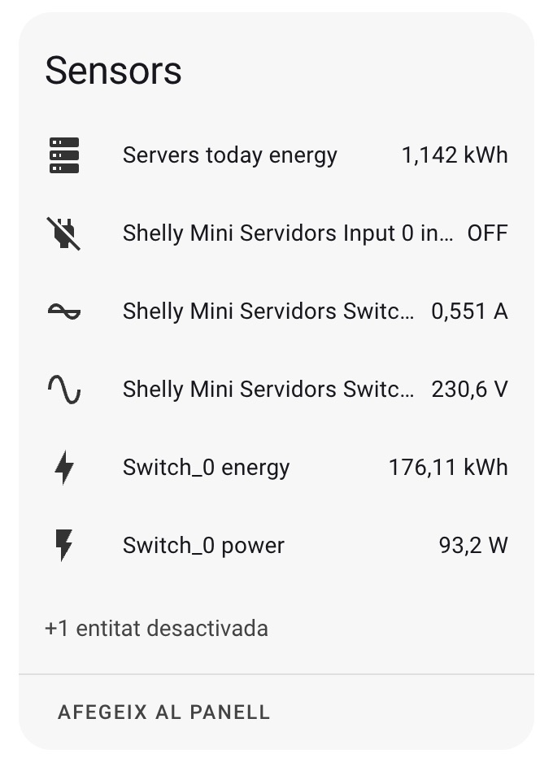
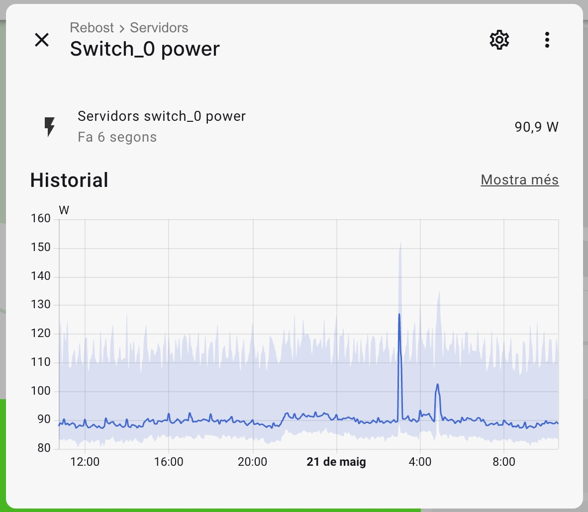

Estic molt content de tenir un [homelab](/blog/el-meu-homelab) a casa. Em permet tenir serveis com Nextcloud, Jellyfin, Vaultwarden, Adguard, Home Assistant i d'altres que em fan la vida més fàcil i a més em permet aprendre coses i jugar amb eines que desconec. I tot això sense dependre de terceres empreses (tant per lo bo com per lo dolent).

El que ja no em fa tant feliç és l'electricitat que consumeix.

## Com controlo el consum?

M'agrada saber el consum de les coses de casa: nevera, forn, rentavaixelles, entre molts d'altres. També el homelab i tenint en compte que està 24/7 funcionant, doncs encara més vull saber quan gasta.

Tot està connectat al SAI i aquest a un endoll, on hi tinc instal·lat un Shelly 1PM Mini Gen 3. D'aquesta manera sé el consum total inclòs el del propi SAI.

El Shelly al mateix temps està vinculat a Home Assistant, així que per defecte ja tinc històric i gràfiques del consum sense haver de fer res. A més també tinc disponibles els Watts de manera instanània.

<figure>
  
</figure>

## I els diners què?

Tot això em permet treure consums instantanis, diaris, setmanals i mensuals. Amb això ja puc saber econòmicament el que em costa tenir tot això encès. Així que anem al gra:

- **Consum diari**: 2,148 kWh/dia
- **Consum mensual**: 64 kWh/mes
- **Consum anual**: 768 kWh/any

El kWh el trec en base del total facturat, que inclou la potència, impostos, energia i altres càrrecs:

- **Cost diari**: 0,62€ (0,29€/kWh)
- **Cost mensual**: 18,6€ (0,29€/kWh)
- **Cost anual**: 223€ (0,29€/kWh)

A part de la part econòmica, a la gràfica es pot veure com a la nit, entre les 3 i les 4 hi ha pics, que corresponen a les tasques de backup que es fan de màquines virtuals, documents i fotos i altres tasques que es fan durant la nit.

Gràcies a això m'és més fàcil prendre consciència del consum i poder optimitzar i també dimensionar millor el sistema. A més, al tenir un SAI connectat puc saber de manera molt més precisa quin serà el consum que haurà d'aguantar el SAI en cas de talls de llum.

## Què en faig de tot això?

Doncs menys del que vull 😞

En base al que vaig veient intento fer ajustar alguna coseta. Per exemple, dels serveix que tinc desplegats intento optimitzar els consums de CPU i RAM. Amb això faig que la CPU no es dispari i no consumeixi watts extres. També intento eliminar serveis als que no els dono ús i que els he afegit per provar o que han quedat en desús.

L'objectiu és optimizar al màxim el sistema per fer que el consum sigui el més baix possible, tenint en compte que té un ús diari de moltes de les eines que hi ha desplegades i que això repercuteix en l'electricitat consumida a casa.
