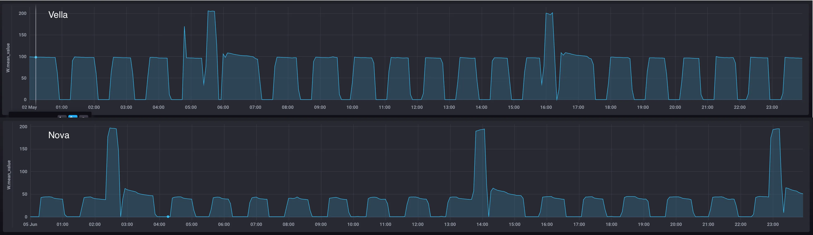

Aquest passat més de Maig ha estat un mes terrible: primer la rentadora i després la nevera. La part bona és que ara tenim uns electrodomèstics que gasten molt menys.

Fa uns dies vaig explicar [com anem amb la rentadora nova](/blog/consum-rentadora) i ara li toca a la nevera. Però en 
aquest cas és molt més fàcil.

La nevera és una Haier HTW5620CNMG amb certificació energètica de classe C.
## Consum

Els pics de potència són semblants, sobre els 200W. Però en el **consum sostingut és quan cau**, tant en el consum màxim (100W vs 50W) i també en els temps de repòs, propiciat per un **millor aïllament i conservació de la temperatura**.

De la mateixa manera que la rentadora, al tenir Wifi i estar connectada també té un **consum residual de 1.18W**, la vella tot i no tenir Wifi també en teni, però més baix, de 0.7W.

Comparant les dues ens quedaria així per un consum mensual:

| Versió | Consum | Cost
| :-------- | :------- | :------- |
| Vella (2012) | 48,9 kWh | 14,181€/mes
| Nove (2025) | 22,80 kWh | 6,612€/mes

## Home Assistant

També tinc la opció de vincular-la amb HA però amb un plugin de HACS. Permet controlar les temperatures, seleccionar els modes predeterminats que té i alguna opció més. Però per exemple, tot i tenir sensor de porta obert i veure'l sempre reporta un estat de "obert", cosa que no em permet poder fer auomatitzacions. Una pena.

<figure>
	
</figure>

## Conclusió

Així com la rentadora no impacte tant a la factura, la nevera clarament si. Tindrà un impacte aproximat d'uns 5-8€ depenent del mes, cosa que fa que sigui molt més justificable el canvi que hem fet.