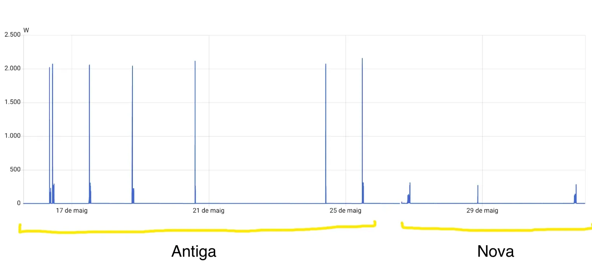

Hem comprat una rentadora Samsung amb IA, 1000 programes, gestió de consums, Smartthings... perquè la vella saltava mentre centrifugava.

Després d'algunes rentades ja podem comparar-la amb la vella.

## Soroll

El soroll ha baixat una barbaritat. Va tancada per tot arreu i al ser, fa que realment sigui molt més silenciosa que l'anterior, tant quan renta co mquan centrifuga

## Consum

Els pics de potència són molt més petits (d'uns 2000 a uns 200W) i fent rentandes semblants: 30-40º i entre 1000 i 1200 rpm.

El consum tot i que està "engegada" y tenir **consum residual de 0.04kWh/dia** (Wifi i tonteries), quedaria així en comparació amb la vella en el **consum mensual** i amb un cost de 0.29€/kWh:

| Versió | Consum | Cost
| :-------- | :------- | :------- |
| Vella (2014) | 4.84 kWh | 1.40€/mes
| Nova (2025) | 2.56 kWh| 0.74€/mes

## Home Assistant

Gràcies a Smartthings tinc tots els estats i altres dades que em permeten controlar molt més automatizacions que ja tenia, com que ens avisi quan acaba. Però ara a més tinc els litres que consumeix la rentadora per cadascuna de les rentades.

La contrapartida és que ara depenc del núvol per tenir tot això, cosa que no m'agrada perquè necessito internet i a més les meves dades a saber on van.

## Conclusió

Va molt bé. Es nota quan les coses són noves (normalment) i ara a més puc jugar amb més coses que abans no tenia, com les dades del consum d'aigua.